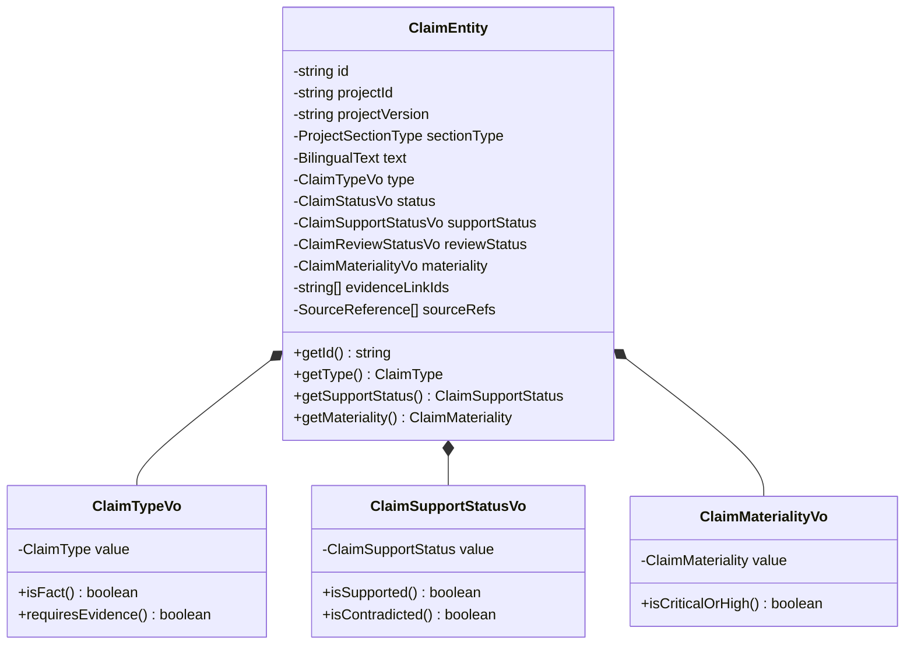

# Claims Domain Model — Venture Hub OS
**Document ID:** VHOS-ARCH-010  
**Specification:** `SPEC-003 — Claims & Evidence Governance`  
**Phase:** `VHOS-PHASE-003`  

---

## 1. Domain Entities & Value Objects

---

## 2. Invariants

1. Every claim is strictly bound to a `projectId` and `projectVersion`.
2. Every claim belongs to a canonical `ProjectSectionType`.
3. Claims have bilingual text representation (`BilingualText`).
4. Type classification (`FACT`, `ESTIMATE`, `ASSUMPTION`, `TARGET`, `HYPOTHESIS`) is immutable by presentation layers.
