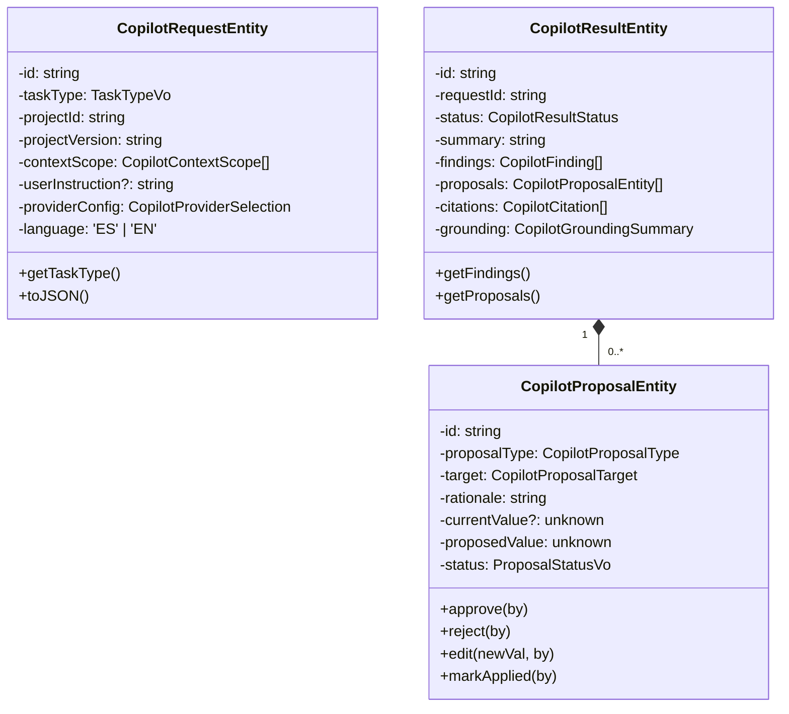

# Venture Hub OS — AI Copilot Domain Model Specification

**Document ID:** `COPILOT-DM-006`  
**Specification:** `SPEC-006`  
**Status:** `ACTIVE`  

---

## 1. Domain Entities & Value Objects

---

## 2. 12 Defined Copilot Tasks & Risk Matrix

| Task Type | Category | Permitted Actions |
| :--- | :--- | :--- |
| `PROJECT_ANALYSIS` | `READ_ONLY_ANALYSIS` | Read-only executive assessment |
| `GAP_ANALYSIS` | `READ_ONLY_ANALYSIS` | Read-only gap identification |
| `TRUST_REVIEW` | `READ_ONLY_ANALYSIS` | Read-only claim/evidence audit |
| `RISK_REVIEW` | `READ_ONLY_ANALYSIS` | Read-only risk evaluation |
| `COMPARISON` | `READ_ONLY_ANALYSIS` | Read-only competitive comparison |
| `EXPLANATION` | `READ_ONLY_ANALYSIS` | Read-only architecture breakdown |
| `EXECUTIVE_SUMMARY_DRAFT` | `DRAFT_GENERATION` | Proposes bilingual summary |
| `PRESENTER_QA_PREPARATION` | `DRAFT_GENERATION` | Proposes Q&A cards |
| `PRESENTER_TALKING_POINTS` | `DRAFT_GENERATION` | Proposes speaker notes |
| `CONTENT_REWRITE_PROPOSAL` | `CHANGE_PROPOSAL` | Proposes section text edits |
| `NARRATIVE_CRITIQUE` | `CHANGE_PROPOSAL` | Proposes narrative flow adjustments |
| `PRESENTATION_CRITIQUE` | `CHANGE_PROPOSAL` | Proposes scene design revisions |
