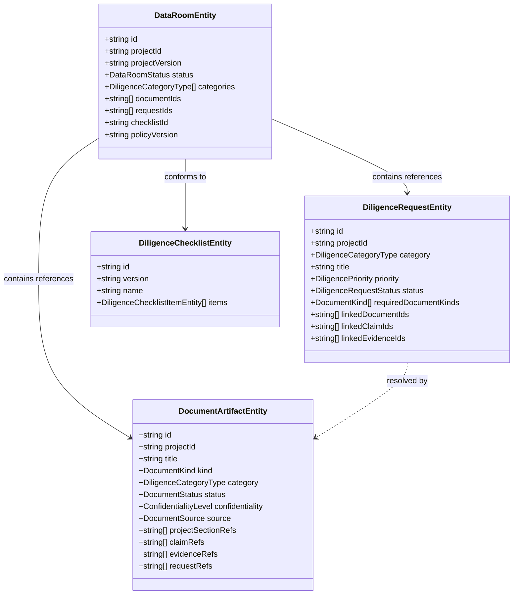

# Due Diligence Data Room Domain Model

**Specification:** `SPEC-007 — Due Diligence Data Room`  
**Module:** `src/modules/data-room/`  
**Status:** `ACTIVE`  

---

## 1. Domain Architecture Diagram

---

## 2. Core Invariants & Governance Rules

1. **Deterministic Taxonomy:** Enforces **23 document kinds** (`CORPORATE`, `LEGAL`, `FINANCIAL`, `TAX`, `COMMERCIAL`, `CUSTOMER`, `MARKET`, `PRODUCT`, `TECHNICAL`, `SECURITY`, `IP`, `REGULATORY`, `TEAM`, `HR`, `OPERATIONS`, `RISK`, `INSURANCE`, `CONTRACT`, `POLICY`, `REPORT`, `MODEL`, `DATASET`, `OTHER`), 16 diligence categories, 9 document statuses, and 4 confidentiality levels.
2. **Strict Traceability:** Document artifacts reference canonical Project Twin sections (`projectSectionRefs`), Claim entities (`claimRefs`), and Evidence objects (`evidenceRefs`).
3. **Informational Security Labels:** Confidentiality tags are metadata labels; access control enforcement is strictly deferred to Phase 008.
4. **Canonical Non-Mutation:** Diligence operations never mutate Project Twin, Claims, or Evidence records.
