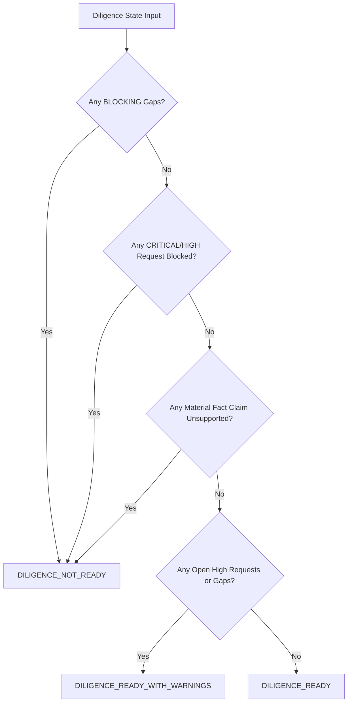

# Diligence Coverage & Readiness Model

**Specification:** `SPEC-007 — Due Diligence Data Room`  
**Policy Version:** `1.0`  
**Status:** `ACTIVE`  

---

## 1. Definition and Role of `CoveragePercent`

In Venture Hub OS, **`CoveragePercent` is strictly an auxiliary, transparent category-level progress indicator**. It is computed deterministically per diligence category $C$:

$$\text{CoveragePercent}(C) = \min\left(100, \text{round}\left(\frac{\text{SatisfiedRequests}(C)}{\max(\text{RequiredItems}(C), \text{TotalRequests}(C), 1)} \times 100\right)\right)$$

### Key Governance Invariant:
> **`CoveragePercent` SHALL NEVER be presented as a synthetic, opaque single-score substitute for explicit counts.**

Diligence decisions require inspection of the primary, itemized metrics:
- **Checklist Coverage:** `requiredItems`, `satisfiedItems`, `partialItems`, `openItems`, `blockedItems`
- **Document Inventory:** `currentDocuments`, `staleDocuments`, `missingDocuments`
- **Traceability Links:** Direct verification of `linkedClaims` and `linkedEvidence`
- **Identified Gaps:** Itemized list of `BLOCKING`, `HIGH`, and `MEDIUM` gaps with remediation hints

---

## 2. Diligence Readiness Decision Tree

