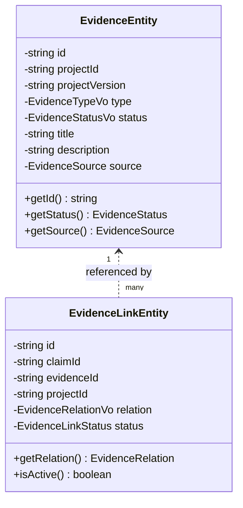

# Evidence Domain Model — Venture Hub OS
**Document ID:** VHOS-ARCH-011  
**Specification:** `SPEC-003 — Claims & Evidence Governance`  
**Phase:** `VHOS-PHASE-003`  

---

## 1. Evidence Entities & Relationships

---

## 2. Evidence Types & Statuses

- **Types:** `DOCUMENT`, `DATASET`, `CALCULATION`, `OBSERVATION`, `EXPERIMENT`, `SYSTEM_RECORD`, `EXTERNAL_REFERENCE`, `MEDIA`, `OTHER`
- **Statuses:** `AVAILABLE`, `MISSING`, `SUPERSEDED`, `DISPUTED`, `INVALID`
- **Relations:** `SUPPORTS`, `PARTIALLY_SUPPORTS`, `CONTRADICTS`, `CONTEXT_ONLY`
