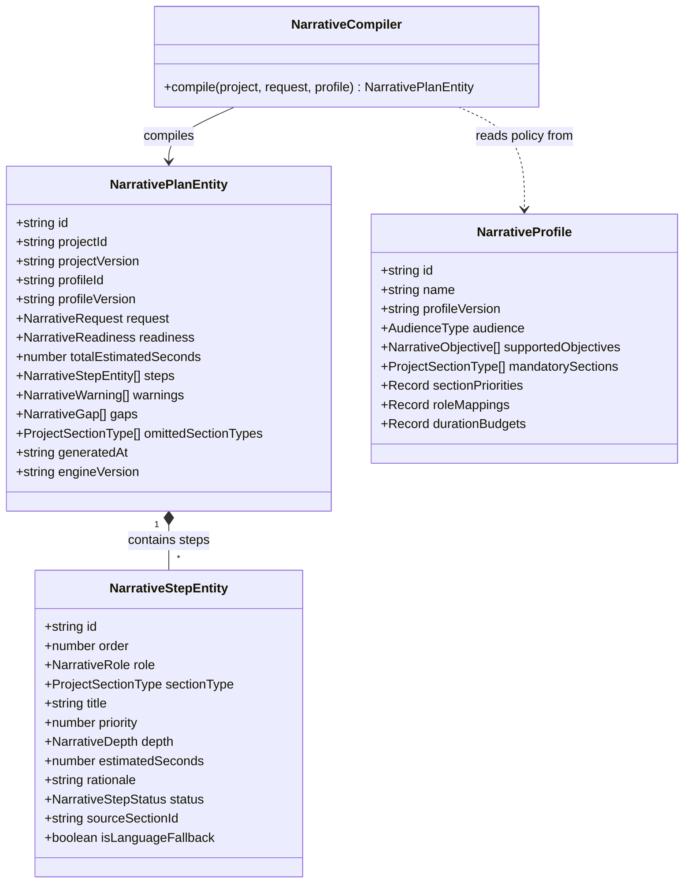

# Narrative Domain Model — Venture Hub OS
**Document ID:** VHOS-ARCH-005  
**Specification:** `SPEC-002 — Adaptive Narrative Engine`  
**Phase:** `VHOS-PHASE-002`  

---

## 1. Domain Architecture Overview

