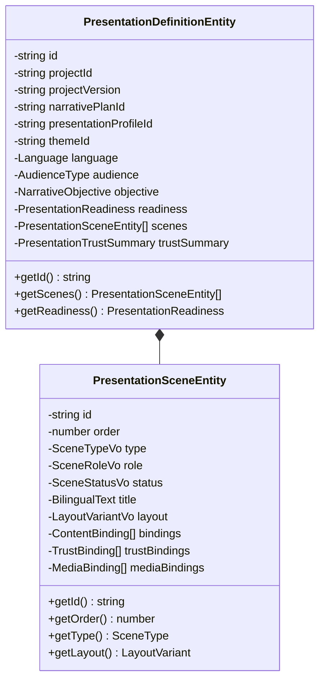

# Presentation Domain Model — Venture Hub OS
**Document ID:** VHOS-ARCH-017  
**Specification:** `SPEC-004 — Executive Presentation Engine`  
**Phase:** `VHOS-PHASE-004`  

---

## 1. Domain Class Diagram

---

## 2. Invariants

1. Scenes are derived projections from `ProjectTwin`, `NarrativePlan`, and `NarrativeTrustContext`.
2. Scene ordering is strictly contiguous and 1-indexed.
3. Every scene references its source `NarrativeStep` and canonical `ProjectSectionType`.
4. Presentation models are 100% immutable across rendering cycles.
