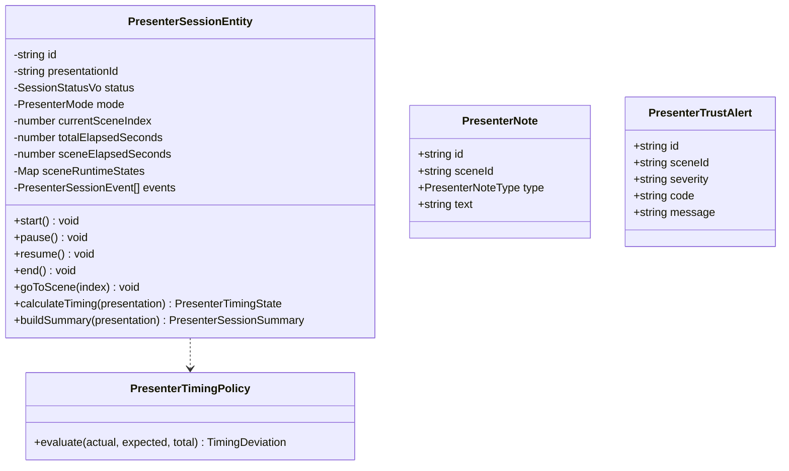

# Presenter Domain Model — Venture Hub OS
**Document ID:** VHOS-ARCH-025  
**Specification:** `SPEC-005 — Executive Presenter Cockpit`  
**Phase:** `VHOS-PHASE-005`  

---

## 1. Domain Class Diagram

