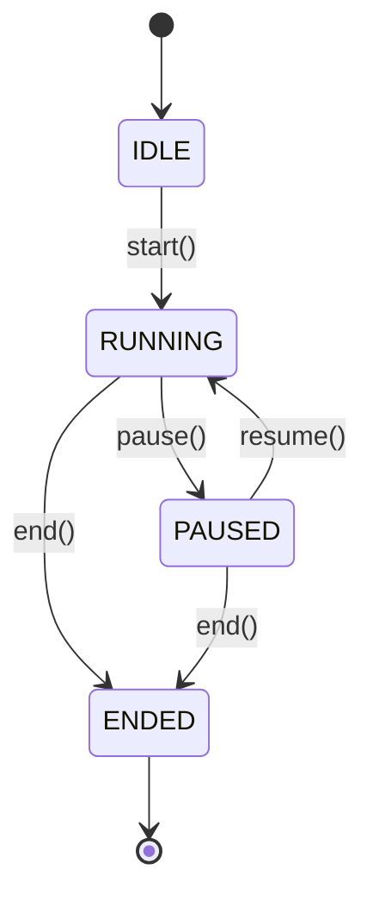

# Presenter Session State Machine — Venture Hub OS
**Document ID:** VHOS-ARCH-026  
**Specification:** `SPEC-005 — Executive Presenter Cockpit`  
**Phase:** `VHOS-PHASE-005`  

---

## 1. State Machine Transitions

## 2. Transition Rules

- Navigation commands (`next`, `prev`, `goToScene`) are allowed in `IDLE`, `RUNNING`, and `PAUSED` states.
- Transitioning from `ENDED` to any state is strictly forbidden and throws `InvalidPresenterSessionTransitionError`.
