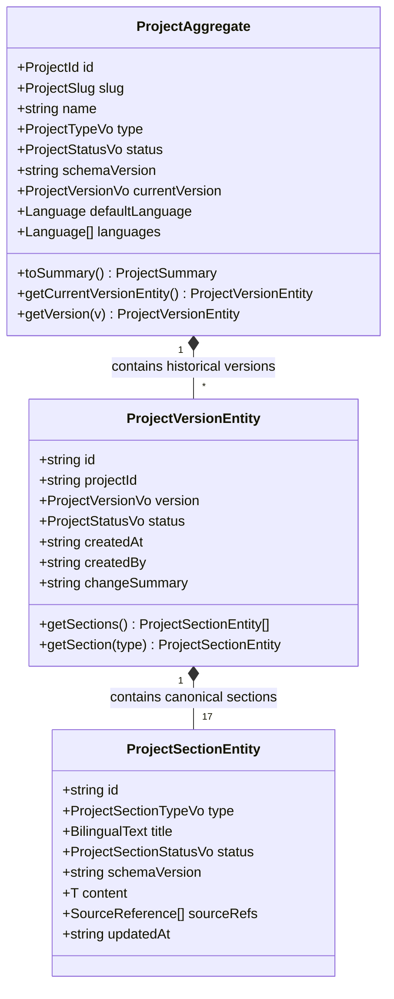

# Project Twin Domain Model — Venture Hub OS
**Document ID:** VHOS-ARCH-001  
**Specification:** `SPEC-001 — Project Workspace & Project Twin`  
**Phase:** `VHOS-PHASE-001`  
**Status:** APPROVED  

---

## 1. Domain Overview

The **Project Twin** is the canonical, structured, versioned domain model representing the complete truth of a venture.

---

## 2. Invariant Rules

1. **Immutable Identity:** `id` cannot be modified once initialized.
2. **Deterministic Current Version:** Declared `currentVersion` must match an active version in `versions`.
3. **Section Uniqueness:** A `ProjectVersion` can contain at most one instance of each canonical section type.
4. **Bilingual Requirement:** Every section title and customer-facing narrative must supply valid bilingual dictionaries (`{es, en}`).
5. **Decoupled Truth:** Domain entities have zero knowledge of HTML, CSS, browser globals, or presentation order.
