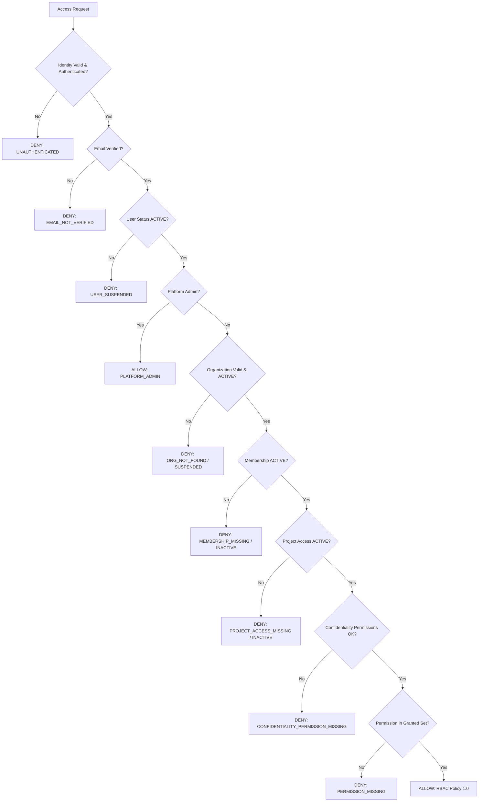

# Authorization Policy & Decision Engine

**Specification:** `SPEC-008 — Security, Authentication, RBAC & Audit`  
**Policy Version:** `1.0`  
**Status:** `ACTIVE`  

---

## 1. Fail-Closed Evaluation Decision Tree

