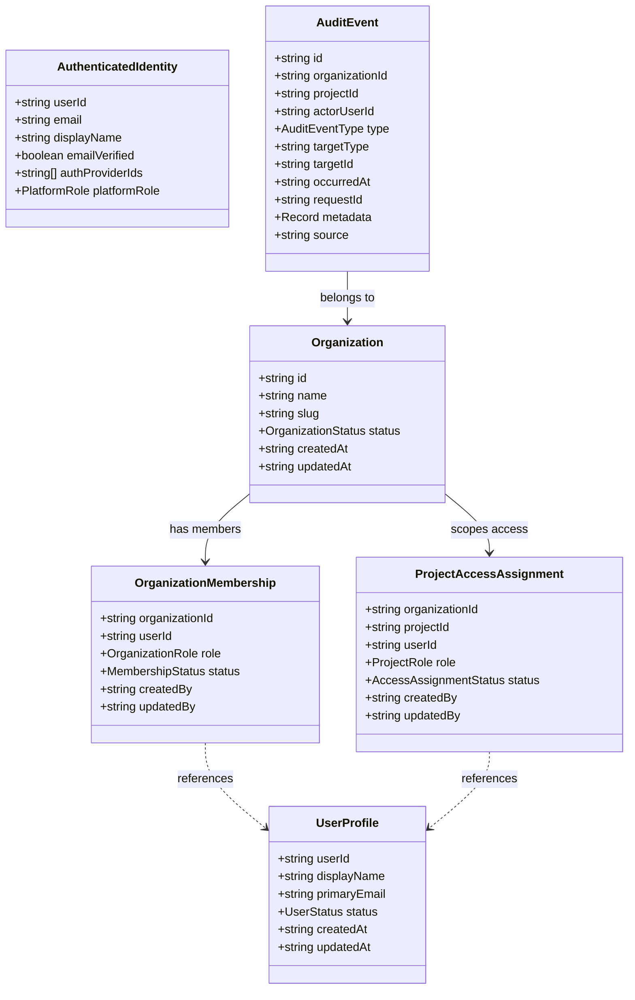

# Security Domain Model: Venture Hub OS

**Specification:** `SPEC-008 — Security, Authentication, RBAC & Audit`  
**Module:** `src/modules/security/`  
**Status:** `ACTIVE`  

---

## 1. Domain Entities Architecture

---

## 2. Invariants & Guardrails

1. **Deterministic Fail-Closed:** Missing identity, missing membership, missing assignment, or inactive status results immediately in `DENY`.
2. **Coarse Platform Roles vs. Scoped Resource Roles:** Platform Admin is modeled through coarse claims (`platformAdmin: true`), while tenant and project roles reside in Firestore records.
3. **Append-Only Audit:** All security state changes emit immutable audit events generated strictly by `TRUSTED_FUNCTION`.
