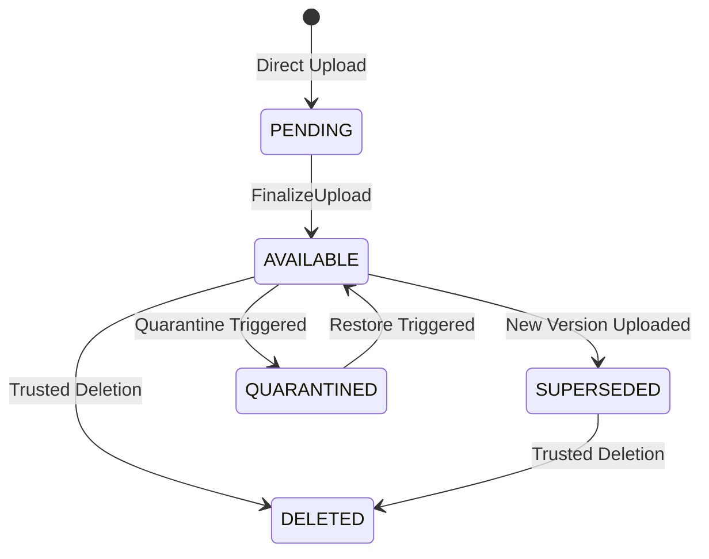

# File Versioning Reference: Phase 009

**Specification:** `SPEC-009 — Secure Storage & Controlled Data Room Sharing`  
**Version:** `1.0`  

---

## 1. Immutability & Version Lineage

- Binary blobs in Cloud Storage are write-once and immutable (`allow update: if false;`).
- When a file is updated/replaced, a new `FileVersionEntity` is created with an incremented `versionNumber` (e.g. `versionNumber: 2`).
- The previous version is marked `SUPERSEDED`, and `supersedesVersionId` links the lineage.
- `FileRecordEntity.currentVersionId` is updated atomically to point to the newest active version.

---

## 2. Version State Machine

