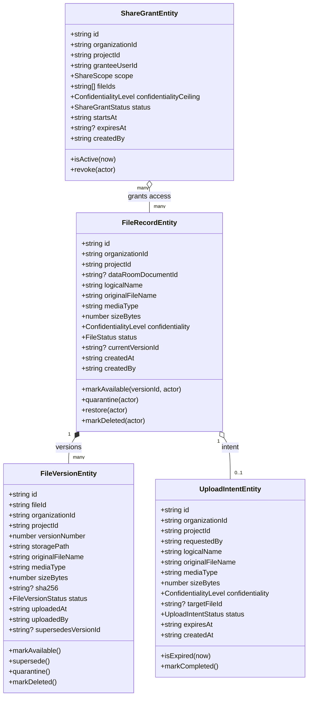

# Secure Storage Domain Model: Phase 009

**Specification:** `SPEC-009 — Secure Storage & Controlled Data Room Sharing`  
**Version:** `1.0`  
**Status:** `ACTIVE`  

---

## 1. Domain Entities & Value Objects

---

## 2. Invariant: `DocumentArtifact ≠ FileRecord ≠ Evidence`

1. **DocumentArtifact:** Metadata record in the due diligence index (Phase 007).
2. **FileRecord:** Metadata pointing to secure binary storage blobs, with lifecycle and versions (Phase 009).
3. **Evidence:** Immutable governance claim support record (Phase 003).

Uploading a file does **NOT** create Evidence, mark a Claim `SUPPORTED`, alter `ClaimSupportStatus`, or modify the Project Twin.

---

## 3. Storage Reason Codes (21 Codes)

`ALLOW`, `UNAUTHENTICATED`, `USER_INACTIVE`, `ORGANIZATION_MISMATCH`, `PROJECT_MISMATCH`, `MEMBERSHIP_INACTIVE`, `PROJECT_ACCESS_INACTIVE`, `FILE_NOT_FOUND`, `FILE_NOT_AVAILABLE`, `FILE_QUARANTINED`, `FILE_DELETED`, `PERMISSION_MISSING`, `CONFIDENTIALITY_PERMISSION_MISSING`, `SHARE_GRANT_MISSING`, `SHARE_GRANT_EXPIRED`, `SHARE_GRANT_REVOKED`, `SHARE_SCOPE_MISMATCH`, `SHARE_CONFIDENTIALITY_EXCEEDED`, `VERSION_NOT_FOUND`, `VERSION_NOT_AVAILABLE`, `UPLOAD_POLICY_REJECTED`.
